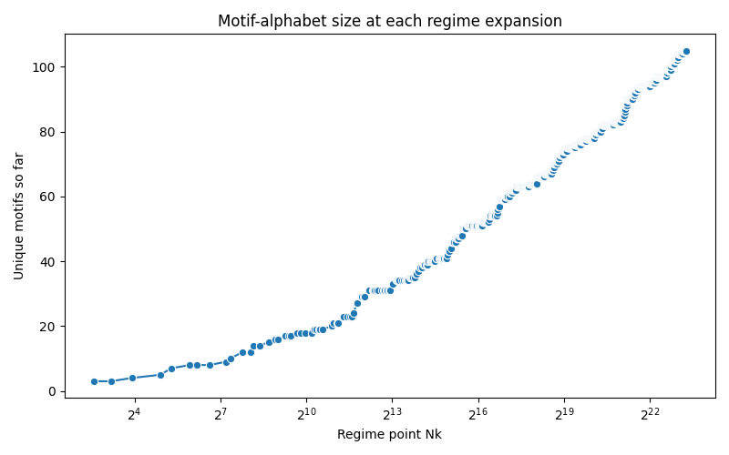
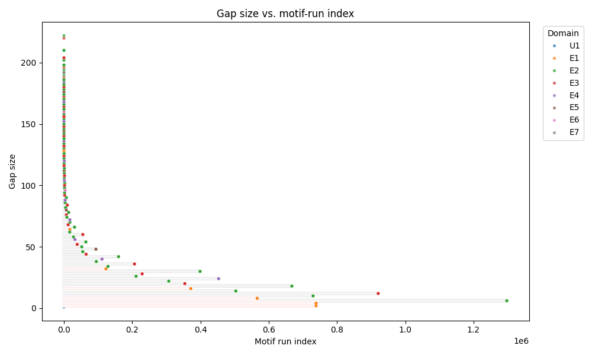
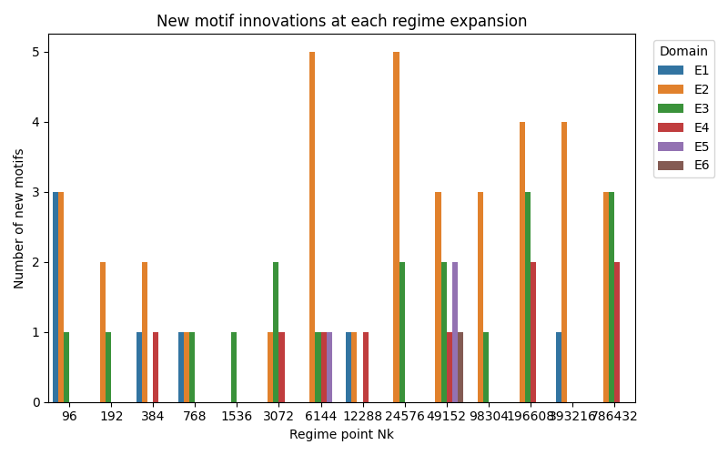

# McCrackn’s Prime Law
[](https://github.com/pt2710/McCrackns-Prime-Law/actions/workflows/ci.yml)

_Repository slug:_ `mccrackns_prime_law`  
**Status:** non‑profit · community‑maintained · volunteer‑run

---

## Abstract
**McCrackn’s Prime Law** is a deterministic, recursive rule that derives every prime directly from its predecessor—no sieves, randomness, or empirical tables required.  
The method is accompanied by mathematical proofs and validation up to \(n = 10^7\).

*Read the full manuscript:* [`McCrackns_prime_law.pdf`](./McCrackns_prime_law.pdf)

---

## Visual Snapshot

<p align="center">
  
  
  
</p>

| Alphabet growth | Gap vs run | Innovations by regime |
| --------------- | ---------- | --------------------- |
| <sub>Sequence size as the prime alphabet expands.</sub> | <sub>Prime gap size versus motif run length.</sub> | <sub>Counts of regime innovations across validated range.</sub> |

---

## Table of Contents
- [Abstract](#abstract)
- [Visual Snapshot](#visual-snapshot)
- [Quick Start](#quick-start)
- [Programmatic Usage](#programmatic-usage)
- [Repository Layout](#repository-layout)
- [Reproducibility & Open Science](#reproducibility--open-science)
- [Community & Governance](#community--governance)
- [Contributing](#contributing)
- [Security](#security)
- [License](#license)
- [Authors & Credits](#authors--credits)

---

## Quick Start

> **Note:** The large pre‑computed dataset `motifs_10m.csv` is stored with **Git LFS**.  
> Install LFS once via `git lfs install` *before* cloning or pulling.

```bash
git clone https://github.com/pt2710/McCrackns-Prime-Law.git
cd McCrackns-Prime-Law
git lfs install

python -m venv .venv
source .venv/bin/activate          # Windows: .venv\Scripts\activate
pip install -r requirements.txt

python test_mccrackns_prime_law.py --plot
```

The script prints prime indices, local regimes, motifs and gap statistics and, with `--plot`, regenerates the snapshots above.

---

## Programmatic Usage

```python
from mccrackns_prime_law import McCracknsPrimeLaw

mpl = McCracknsPrimeLaw(n_primes=20)
mpl.generate()
print(mpl.get_primes())
```

---

## Repository Layout
```
mccrackns_prime_law/
├── .gitattributes               # Git LFS tracking rules
├── figures_visible/             # Interactive PNGs & CSVs (large via LFS)
├── src/                         # Library code
│   ├── __init__.py
│   └── prime_utils.py
├── tests/
│   └── test_basic.py
├── McCrackns_prime_law.pdf      # Formal manuscript
├── motifs_10m.csv               # Pre‑computed dataset (LFS pointer)
└── ...
```

*(see full tree in the repo)*

---

## Reproducibility & Open Science
All code, data and figures are provided under an OSI‑approved license to foster independent verification.

---

## Community & Governance
This project has no corporate backing and relies entirely on volunteers.  
See **[`CONTRIBUTING.md`](./CONTRIBUTING.md)** to learn how to help.

---

## Contributing
Bug reports, feature requests and PRs of any size are welcome.  
Please read the guidelines in [`CONTRIBUTING.md`](./CONTRIBUTING.md) before you start hacking.

---

## Security
If you believe you have found a vulnerability, **do not open a public Issue**.  
Instead, follow the private process in [`SECURITY.md`](./SECURITY.md).

---

## License
Released under the **MIT License**. See [`LICENSE`](./LICENSE).

---

## Authors & Credits
Created by **Budd McCrackn** with help from a growing community of prime‑enthusiasts.

_Last updated: 2025-06-17_
