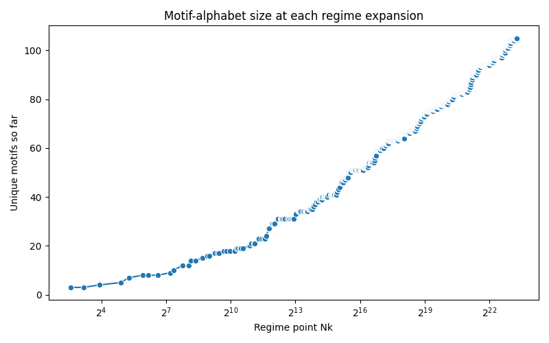
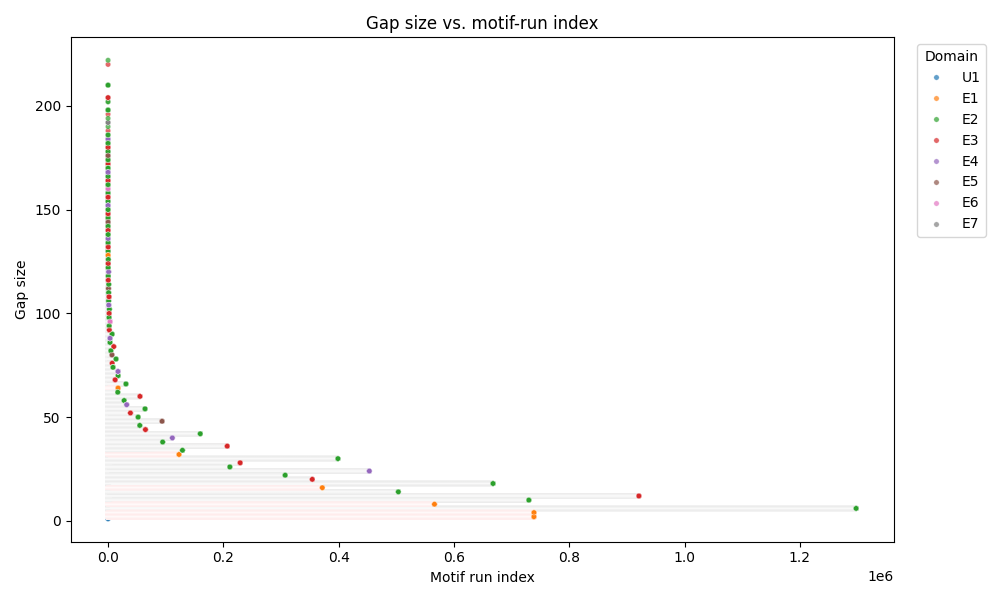
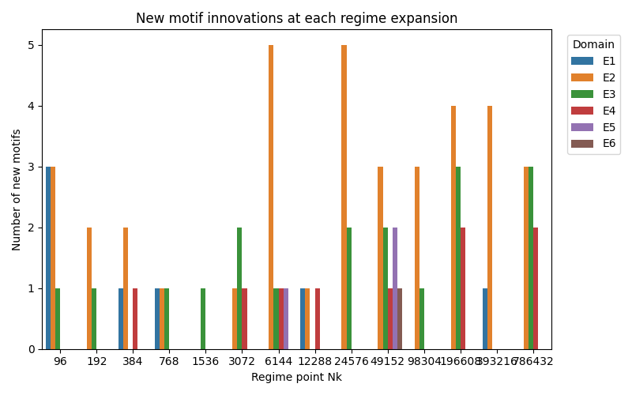

# McCrackn’s Prime Law
[](https://github.com/pt2710/McCrackns-Prime-Law/actions/workflows/ci.yml)
[](https://doi.org/10.5281/zenodo.20343409)

_Repository slug:_ `MPL-TC`  
**Status:** non‑profit · community‑maintained · volunteer‑run

---

## Abstract
**McCrackn’s Prime Law** is a deterministic regime/motif successor architecture for the prime stream.  
**Triadic Completeness** is the separate Unity / Even / Odd domain layer that recursively covers positive integers once the prime axes are realized.

📄 **Read the full manuscript on Zenodo:** [https://doi.org/10.5281/zenodo.20343409](https://doi.org/10.5281/zenodo.20343409)
✉️ **Contact:** [thenothingnesseffect@gmail.com](mailto:thenothingnesseffect@gmail.com)  
🧬 **ORCID:** [0009-0001-4400-0171](https://orcid.org/0009-0001-4400-0171)

*Or view the local version:* [`McCrackns_prime_law.pdf`](./McCrackns_prime_law.pdf)

---

## MPL/TC V3 Architecture

The repository keeps the paper's layers separate:

- `mccrackns_prime_law.py` records a bounded executable MPL prefix with explicit motif/regime transitions. `U1` is seed-only for `2 -> 3`; every later gap is even. The bounded tape is an implementation artifact, not the full unbounded MPL theory.
- `triadic_domains.py` models finite-prefix TC placement: `U1`, dyadic `E` faces, `O1` for the prime/free odd axis, and lpf-based `O2`, `O3`, `O4`, ... composite strata.
- The Axis Law / First-Hole bridge is represented as finite executable validation in the TC layer and tests, not as the MPL runtime.
- GCD is not used by the MPL generator. If added in future diagnostics, it must remain a post-hoc sentinel or contradiction guard only.
- Implementation-support status is tracked in [`docs/claim_status_matrix.md`](docs/claim_status_matrix.md), [`docs/unbounded_scheduler_proof_obligations.md`](docs/unbounded_scheduler_proof_obligations.md), and [`docs/theorem_implementation_map.md`](docs/theorem_implementation_map.md). The compressed regime/motif O(1) scheduler remains a mathematical claim and proof/implementation target, not a completed repository feature.

## Derivation-Level Unbounded Lagged Certificate-Frontier Scheduler

The repository also includes `lagged_certificate_frontier.py`, an executable
implementation of the paper's derivation-level unbounded lagged TC
certificate-frontier scheduler. This scheduler distinguishes generated values
from derivations, records allowed and forbidden derivations separately, and
tracks activation cohorts, active multipliers, known targets, delayed
obstruction horizons, and prime buffers.

The current emitted axis `q_n` is a known target but not an active multiplier
inside recursion `R_n`. Objects created or certified during `R_n` activate only
after the recursion closes. The scheduler delays `q_n^2` until the next
recursion, normalizes composite value certificates by sorted factor words,
deduplicates aliases such as `3 * 15 = 5 * 9 = 45`, and keeps derivation aliases
for audit/debugging. In particular, a forbidden derivation does not forbid the
numeric value when another allowed derivation generates it.

The concrete scheduler uses generated certificate maintenance,
merge/compare-style marker readout, multiplication of active emitted axes by
known targets, derivation legality checks from recursion metadata, and canonical
normalization. It does not use gcd filtering, primality tests, trial division,
sieve arrays, wheel residues, candidate scanning, hardcoded prime tables,
hardcoded gap tables, or finite precomputed gap tapes as runtime mechanisms.

Concrete runtime is data-structure-dependent. The finite-prefix regression
tests are implementation evidence, not mathematical proof. The O(1) claim
belongs only to the stronger compressed-motif/unit-cost hypothesis unless the
bounded lagged-closure compression theorem is later supplied.

---

## Visual Snapshot

<p align="center">
  
  
  
</p>

| Alphabet growth | Gap vs run | Innovations by regime |
| --------------- | ---------- | --------------------- |
| <sub>Sequence size as the prime alphabet expands.</sub> | <sub>Prime‑gap size versus motif run length.</sub> | <sub>Counts of regime innovations across validated range.</sub> |

---

## Table of Contents
- [Abstract](#abstract)
- [Visual Snapshot](#visual-snapshot)
- [Quick Start](#quick-start)
- [Programmatic Usage](#programmatic-usage)
- [Repository Layout](#repository-layout)
- [Reproducibility & Open Science](#reproducibility--open-science)
- [Community & Governance](#community--governance)
- [Contributing](#contributing)
- [Security](#security)
- [License](#license)
- [Authors & Credits](#authors--credits)

---

## Quick Start

> **Note:** The large pre‑computed dataset `motifs_10m.csv` is stored with **Git LFS**.  
> Install LFS once via `git lfs install` *before* cloning or pulling.

```bash
# 1 · Clone & enter
git clone https://github.com/pt2710/MPL-TC.git
cd MPL-TC

# 2 · Ensure Git LFS is enabled (one‑time per machine)
git lfs install

# 3 · Create isolated Python env (3.9+)
python -m venv .venv
source .venv/bin/activate        # macOS / Linux
# .venv\Scripts\activate.bat   # Windows (PowerShell users: Activate.ps1)

# 4 · Install runtime deps
pip install -r requirements.txt

# 5 · Verify the bounded executable prefix
python test_mccrackns_prime_law.py --plot
```

The script prints prime indices, local regimes, motifs and gap statistics, and regenerates the figures above when `--plot` is supplied.

---

## Programmatic Usage

```python
from mccrackns_prime_law import McCracknsPrimeLaw

mpl = McCracknsPrimeLaw(n_primes=20)
mpl.generate()
print(mpl.get_primes())
```

---

## Repository Layout

<details>
<summary>Click to expand full tree</summary>

```
mccrackns_prime_law/
├── .github/
│   └── workflows/
│       └── ci.yml
├── configs/
│   └── default.yaml
├── figures_visible/
│   ├── chunks/
│   ├── alphabet_growth.png
│   ├── cumulative_motifs.png
│   ├── gap_boxplot_by_domain.png
│   ├── gap_evolution_domains.png
│   ├── gap_vs_run.png
│   └── innovations_by_regime.png
├── src/
│   ├── __init__.py
│   ├── prime_utils.py
│   └── your_module.py
├── tests/
│   └── test_basic.py
├── .gitattributes
├── .gitconfig
├── .gitignore
├── CODE_OF_CUNDUCT.md
├── compute_motifs.py
├── CONTRIBUTING.md
├── LICENSE
├── MAINTAINERS.md
├── McCrackns_prime_law.pdf
├── mccrackns_prime_law.py
├── next_prime.py
├── numbers_domains.py
├── README.md
├── requirements.txt
├── ruleset.json
├── SECURITY.md
├── state.json
├── triadic_domains.py
└── test_mccrackns_prime_law.py
```
</details>

---

## Reproducibility & Open Science
All code, data and figures are provided under an OSI‑approved license to foster independent verification.  
Run the notebooks, re‑plot the data, or extend the proofs—then open a Pull Request or Discussion to share your findings!

---

## Community & Governance
McCrackn’s Prime Law is **community‑maintained**. There is currently **no corporate backing and no single full‑time maintainer**.  
We rely on volunteers for everything from issue triage to peer‑review of new proofs. If you’d like to help, see [`CONTRIBUTING.md`](./CONTRIBUTING.md).

---

## Contributing
Bug reports, feature requests and PRs of any size are welcome.  
Please read the guidelines in [`CONTRIBUTING.md`](./CONTRIBUTING.md) before you start hacking.

---

## Security
If you believe you have found a vulnerability, **do not open a public Issue**.  
Instead, follow the private process in [`SECURITY.md`](./SECURITY.md).

---

## License
This project is released under the **MIT License**. See [`LICENSE`](./LICENSE) for details.

---

## Authors & Credits
Created by **Budd McCrackn**  
📧 Contact: [thenothingnesseffect@gmail.com](mailto:thenothingnesseffect@gmail.com)  
🔗 ORCID: [0009-0001-4400-0171](https://orcid.org/0009-0001-4400-0171)

...extended by a growing community of mathematicians, coders and prime‑enthusiasts.  
See `AUTHORS.md` (or the GitHub contributions graph) for a full list of contributors.

---

_Last updated: 2025-06-24_
025-06-23_
