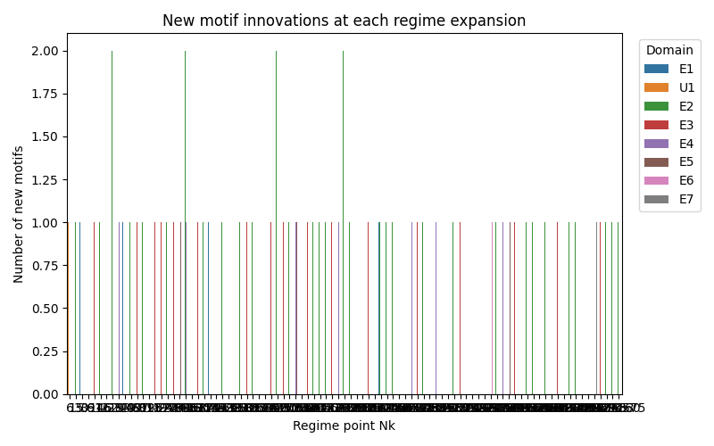

# McCrackn’s Prime Law
[](https://github.com/pt2710/McCrackns-Prime-Law/actions/workflows/ci.yml)

_Repository slug:_ `mccrackns_prime_law`  
**Status:** non‑profit · community‑maintained · volunteer‑run

---

## Abstract
**McCrackn’s Prime Law** is a deterministic, recursive rule that derives every prime directly from its predecessor—no sieves, randomness, or empirical tables required.  
The method is accompanied by mathematical proofs and validation up to \(n = 10^7\).

*Read the full manuscript:* [`McCrackns_prime_law.pdf`](./McCrackns_prime_law.pdf)

---

## Visual Snapshot

<p align="center">
  
  
  
</p>

| Alphabet growth | Gap vs run | Innovations by regime |
| --------------- | ---------- | --------------------- |
| <sub>Sequence size as the prime alphabet expands.</sub> | <sub>Prime‑gap size versus motif run length.</sub> | <sub>Counts of regime innovations across validated range.</sub> |

---

## Table of Contents
- [Abstract](#abstract)
- [Visual Snapshot](#visual-snapshot)
- [Quick Start](#quick-start)
- [Programmatic Usage](#programmatic-usage)
- [Repository Layout](#repository-layout)
- [Reproducibility & Open Science](#reproducibility--open-science)
- [Community & Governance](#community--governance)
- [Contributing](#contributing)
- [Security](#security)
- [License](#license)
- [Authors & Credits](#authors--credits)

---

## Quick Start

> **Note:** The large pre‑computed dataset `motifs_10m.csv` is stored with **Git LFS**.  
> Install LFS once via `git lfs install` *before* cloning or pulling.

```bash
# 1 · Clone & enter
git clone https://github.com/pt2710/McCrackns-Prime-Law.git
cd McCrackns-Prime-Law

# 2 · Ensure Git LFS is enabled (one‑time per machine)
git lfs install

# 3 · Create isolated Python env (3.9+)
python -m venv .venv
source .venv/bin/activate        # macOS / Linux
# .venv\Scripts\activate.bat   # Windows (PowerShell users: Activate.ps1)

# 4 · Install runtime deps
pip install -r requirements.txt

# 5 · Verify the theorem for the first 10⁵ primes
python test_mccrackns_prime_law.py --plot
```

The script prints prime indices, local regimes, motifs and gap statistics, and regenerates the figures above when `--plot` is supplied.

---

## Programmatic Usage

```python
from mccrackns_prime_law import McCracknsPrimeLaw

mpl = McCracknsPrimeLaw(n_primes=20)
mpl.generate()
print(mpl.get_primes())
```

---

## Repository Layout

<details>
<summary>Click to expand full tree</summary>

```
mccrackns_prime_law/
├── .github/
│   └── workflows/
│       └── ci.yml                 # CI pipeline (pytest + lint)
├── configs/
│   └── default.yaml               # Tunable parameters
├── figures_visible/               # Interactive PNGs & CSVs (LFS pointers)
│   ├── chunks/
│   ├── alphabet_growth.png
│   ├── cumulative_motifs.png
│   ├── gap_boxplot_by_domain.png
│   ├── gap_evolution_domains.png
│   ├── gap_vs_run.png
│   └── innovations_by_regime.png
├── src/
│   ├── __init__.py
│   ├── prime_utils.py             
│   └── your_module.py             
├── tests/
│   └── test_basic.py
├── .gitattributes                 
├── .gitconfig      
├── .gitignore                     
├── CODE_OF_CUNDUCT.md      
├── compute_motifs.py              # Compute motifs     
├── CONTRIBUTING.md                # Contribution guidelines
├── LICENSE                        # MIT License
├── MAINTAINERS.md
├── McCrackns_prime_law.pdf        # Formal manuscript
├── mccrackns_prime_law.py         # Single‑file reference implementation
├── next_prime.py                  # CLI helper
├── numbers_domains.py             # Support module
├── README.md                      # Project overview (this file)
├── requirements.txt               # Runtime dependencies
├── ruleset.json
├── SECURITY.md                    # Responsible‑disclosure policy
├── state.json
└── test_mccrackns_prime_law.py
```
</details>

*(Generated 2025-06-17; run `tree -L 3` to refresh.)*

---

## Reproducibility & Open Science
All code, data and figures are provided under an OSI‑approved license to foster independent verification.  
Run the notebooks, re‑plot the data, or extend the proofs—then open a Pull Request or Discussion to share your findings!

---

## Community & Governance
McCrackn’s Prime Law is **community‑maintained**. There is currently **no corporate backing and no single full‑time maintainer**.  
We rely on volunteers for everything from issue triage to peer‑review of new proofs. If you’d like to help, see **[`CONTRIBUTING.md`](./CONTRIBUTING.md)**.

---

## Contributing
Bug reports, feature requests and PRs of any size are welcome.  
Please read the guidelines in [`CONTRIBUTING.md`](./CONTRIBUTING.md) before you start hacking.

---

## Security
If you believe you have found a vulnerability, **do not open a public Issue**.  
Instead, follow the private process in [`SECURITY.md`](./SECURITY.md).

---

## License
This project is released under the **MIT License**. See [`LICENSE`](./LICENSE) for details.

---

## Authors & Credits
Created by **Budd McCrackn** and extended by a growing community of mathematicians, coders and prime‑enthusiasts.  
See `AUTHORS.md` (or the GitHub contributions graph) for a full list of contributors.

---

_Last updated: 2025-06-17_
